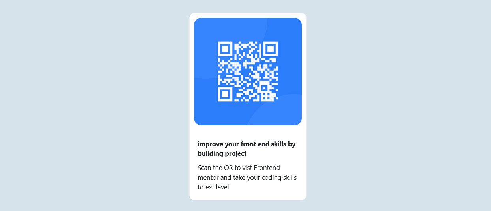

# Frontend Mentor - QR code component solution

This is a solution to the [QR code component challenge on Frontend Mentor](https://www.frontendmentor.io/challenges/qr-code-component-iux_sIO_H). Frontend Mentor challenges help you improve your coding skills by building realistic projects. 

## Table of contents

- [Frontend Mentor - QR code component solution](#frontend-mentor---qr-code-component-solution)
  - [Table of contents](#table-of-contents)
  - [Overview](#overview)
    - [Screenshot](#screenshot)
    - [Links](#links)
  - [My process](#my-process)
    - [Built with](#built-with)
    - [What I learned](#what-i-learned)
    - [Continued development](#continued-development)
    - [Useful resources](#useful-resources)
  - [Author](#author)
  - [Acknowledgments](#acknowledgments)

## Overview

### Screenshot

### Links

- Live Site URL: [Add live site URL here](https://https://emmanuel881.github.io/emmenuel881.github.io/)

## My process

### Built with

- CSS custom properties
- Flexbox
- HTML
- Boostrap 

### What I learned

* By doing this challange i got a better understaning of flex and grid containers and cases when on is more prefered, Bootstrap card played a major role

### Continued development

* Am looking forward to deeply understand break-points in relation to bootstrap containers 

### Useful resources

- (https://getbootstrap.com/docs/5.0/components/card/) - This is an amazing article which helped me finally understand card in Bootstrap for neetly packaging images and text in a container. I'd recommend it to anyone still learning this concept.

## Author

- Frontend Mentor - [@emmanuel881](https://www.frontendmentor.io/profile/yourusername)

